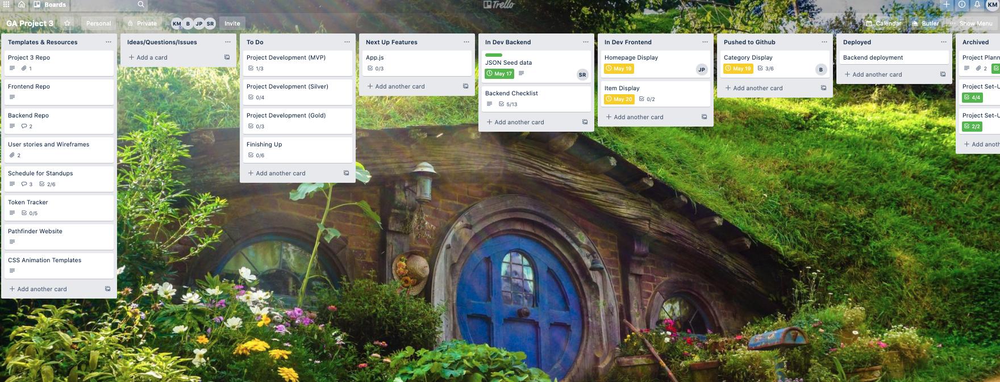
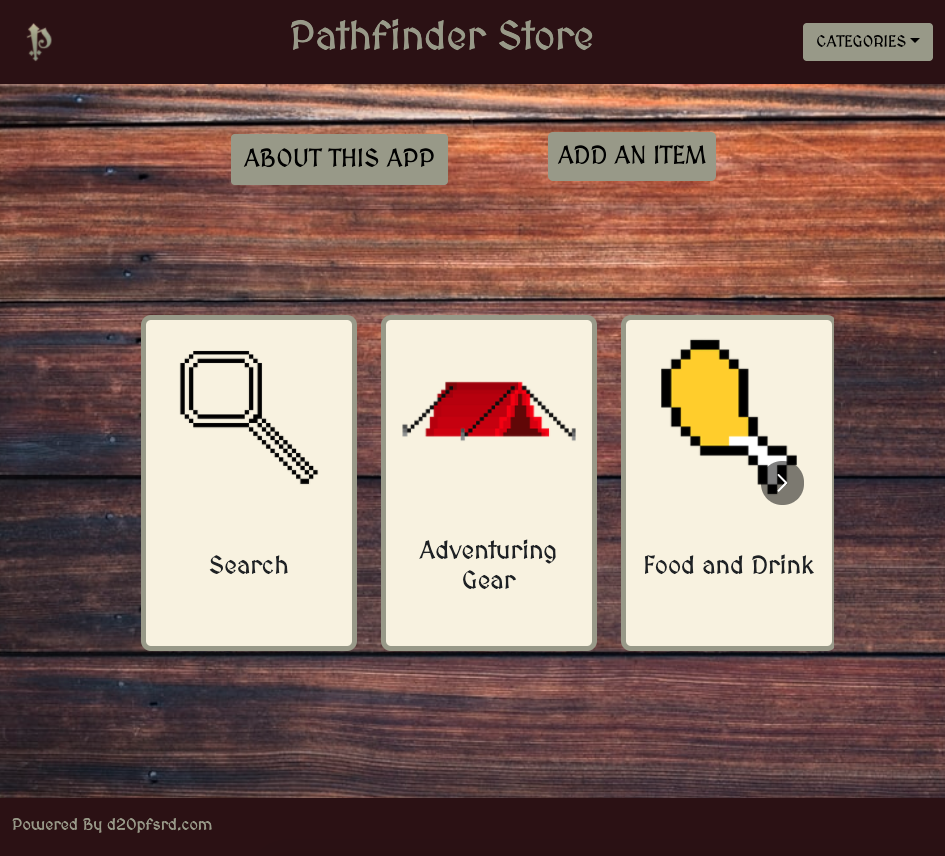
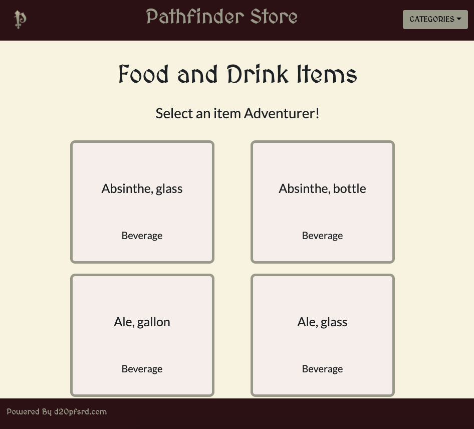
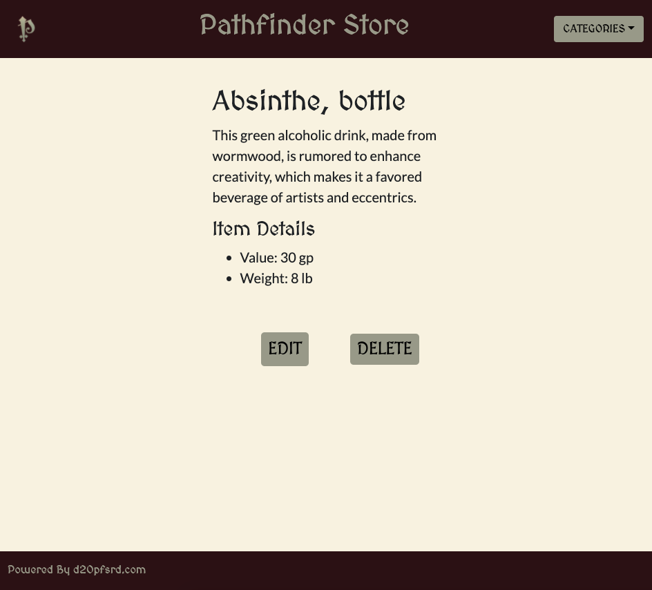
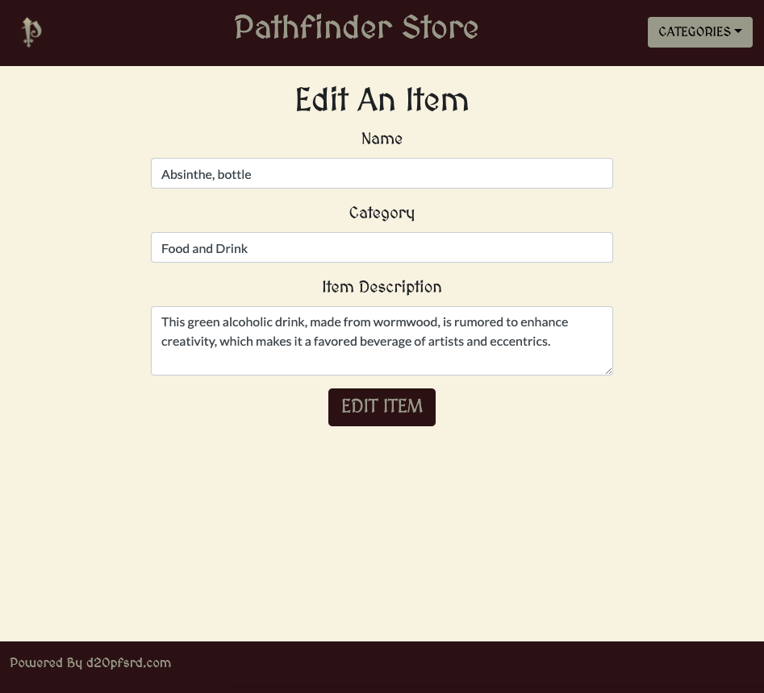
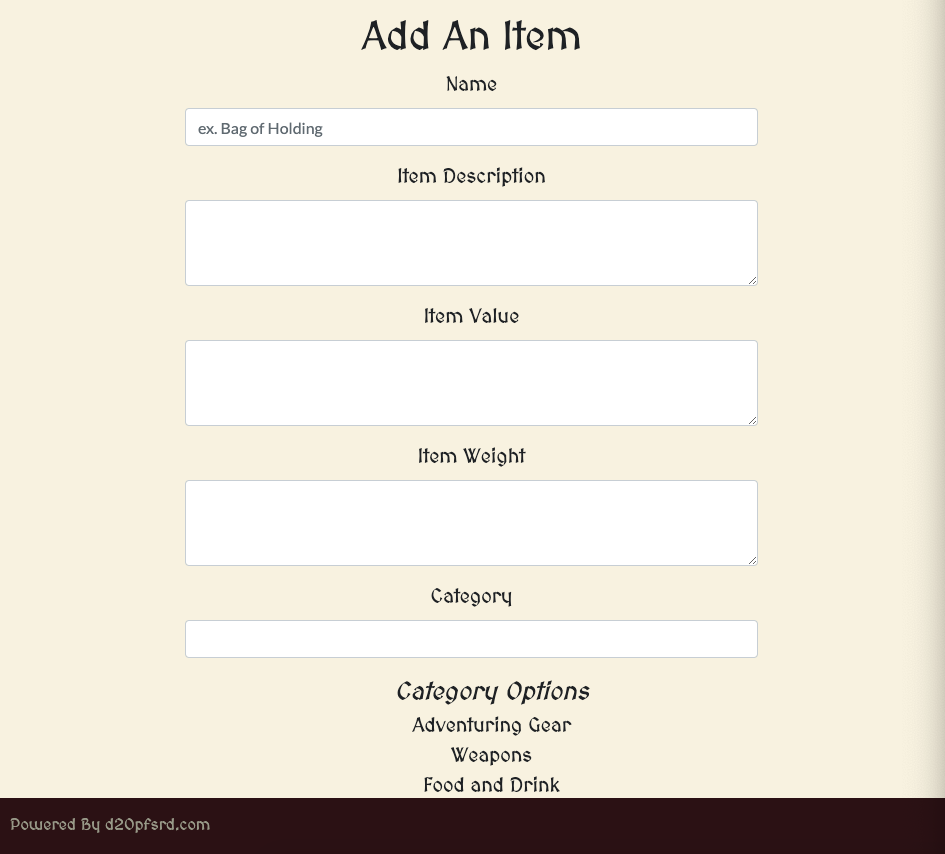

# Pathfinder Store

## Project Description

This is a store for Pathfinder. Pathfinder is a fantasy tabletop role playing game. Search our inventory to see information about items for your characters.

This project was for General Assembly's Software Engineering Immersive.


[Trello Board](https://trello.com/b/Qa4HgioB/ga-project-3)

Repo Links:
[Backend Repo](https://github.com/kristenmoran/Project-3-Backend)
[Frontend Repo](https://github.com/kristenmoran/Project-3-Frontend)

Team Members:
Justin
Sean
Bijal
Kristen

The final result can be viewed here: [Pathfinder](https://pathfinder-store.herokuapp.com/)

## From the Database

### Homepage



### Category Page



### Item Page



### Edit Page



### Add Page



## Features/User Stories

## User Stories

- _As a user, I want to see a listing of all items in the Pathfinder store_
- _As a user, I want to click on a specific category of items and see all the items in that category_
- _As a user, I want to click on a specific item and see the description and stats on the item_

_**Post Stretch Goal**_

Silver

- _As a user, I want to be able to authorize and authenticate their profile_
- _As a user, I want to assign items to a user_
- _As a user, I want to search for a specific item_

Gold

- _As a user, I want to add reference IDs for a GM and player to the items_
- _As a user, I want a GM to pull up their information for a campaign_
- _As a user, I want to add pictures to the items_

## Issues/Hurdles

When the homepage loads it's not response.
When your search results in two items the items overlap.

## Technologies and Frameworks Used

- HTML5, CSS, JavaScript, React, React Hooks, React Router, Bootstrap, MongoDB, Mongoose, Node.js, Nodemon, React-multi-carousel

## Installation

```
Install Pathfinder Store:
1. Fork & clone the repository
2. Add/enhance features and technologies!
3. Submit any issues
```

## Contribute

This is a group project presented for evaluation for General Assembly and is not open for outside contributions at this time. However, if you have feature suggestions to improve the usability or functionality of the application, feel free to create an Issue on this GitHub repository.

[Issue Tracker Frontend](https://github.com/kristenmoran/Project-3-Frontend/issues)
[Issue Tracker Backend](https://github.com/kristenmoran/Project-3-Backend/issues)
